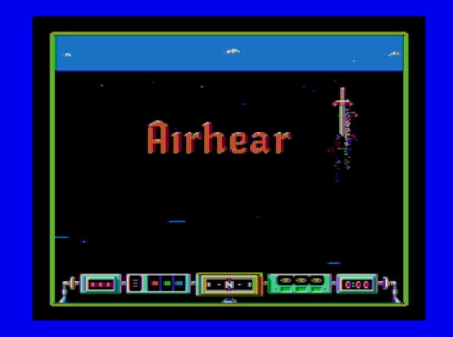

# Compatibility

### A2C_TangyPack is NOT compatible with PAL at this time.

## NTSC Apple IIc/IIc+

TangyPack uses a technique called scan doubling to generate it's video signals for the VGA and HDMI/DVI compatible output.  This is method is relatively simple to implement and has minimal delay on the output image, but is tightly coupled to the source video signal timing.  Scan doubling the Apple IIc video output gets us fairly close to the 640x480 @ 60Hz video standard, but is technically out of spec.  

 **This means while many video displays will work with it, some will not.**   

 Here is a list of devices I have tested or have been reported by others to either work or not work with the Tangy Pack. [Tangy Pack Compatibility List](./Tangy%20Pack%20Compatibilty%20List%20.ods)

Please be aware some displays will scale and apply image filtering to the input images which will destroy the scanline effects and/or stretch the image from it's normal 4:3 size.

In addition, the HDMI port implementation of the Tang Nano 9K FPGA board is not strictly speaking, compliant to the HDMI/DVI standard.  This can causes several problems, which we will cover in the below section.

## Desktop Computer Monitors 
In general, these devices have the best compatibility with the HDMI/DVI and VGA outputs.  Also in general, the VGA input has better compatibility than the HDMI input.  I have a small "Security Monitor LCD" and a late 2000 LCD TV monitor that has both VGA and HDMI input.  Both LCDs works fine on the VGA input, but the HDMI input will show either blank screen or "Resolution not supported" message.

## TVs with HDCP 

These devices usually requires CEC, SCL and SDA signals on the HDMI connector to be pulled up to 5V through pull up resistors.

Tang Nano 9K does have the pull up resistors, but the 5V is not connected on the board.  

A simple $10 device called "USB Power Inserter" like this one https://www.amazon.com/dp/B08MFG27XM?ref=ppx_yo2ov_dt_b_fed_asin_title  supplies the 5V on the connector.  My LG and Samsung LCD TVs works fine with the Tangy Pack using this device. 

 

## HDMI Capture Cards

Tang Nano does not have the HPD(Hot Plug Detect) pin connected.  This seems to confuse the capture cards when you plug in the HDMI connector with the capture card powered up and active.  Having everything connected and then plugging in the capture card and then activating the device seems to work best for me.

Second issue is that some of the capture cards seems to be very particular about the video timing or does not support the 640x480@60 resolution.  One capture device I have will not lock to even to spec compliant 640x480@60 test signal.  

Third issue seems to be some of these devices does not like the output driver of the Tang Nano.  It causes image artifacts on the screen like shown below.

Using an active HDMI signal repeater/booster device fixes the image problem. 

What you are looking for is an **active** hdmi repeater. The passive HDMI connector meant to just extend the cable will not work.  Amazon seems to have a few models from ~$20 to ~$40.  I also found a few ~$10 devices on Aliexpress that seems to work.  Here's the list of devices that I have tried.

* [Amazon Bytecc HDMI Amplifier Repeater ](https://www.amazon.com/dp/B0CRK292K6?ref=ppx_yo2ov_dt_b_fed_asin_title&th=1) ~$25 Worked
 
* [Aliexpress - 8K HDMI Signal Amplifier Booster Extender](https://www.aliexpress.us/item/3256806506866287.html) ~$8 Worked  

* [Aliexpress - 8K Extender Repeater](https://www.aliexpress.us/item/3256806639053743.html) ~$8 Worked  
* [Aliexpress - Mini 4K*2K HDMI 2.0 Extender](https://www.aliexpress.us/item/3256804417878705.html) ~$15.  **Did NOT work** . Looses lock and blinks
 

Using the active HDMI booster, I was able to get two (Grey and larger black) of my test capture devices to work.  I could not get the small black HDMI to USB2 capture device to work at all.

