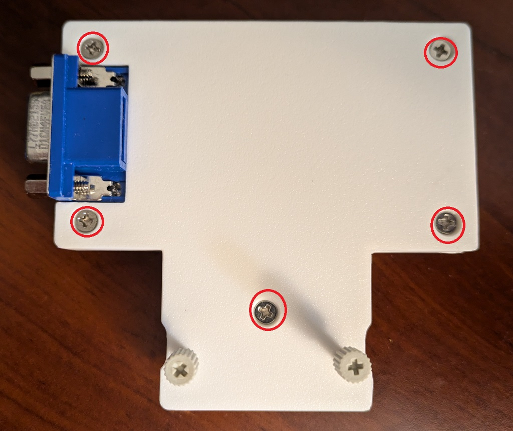
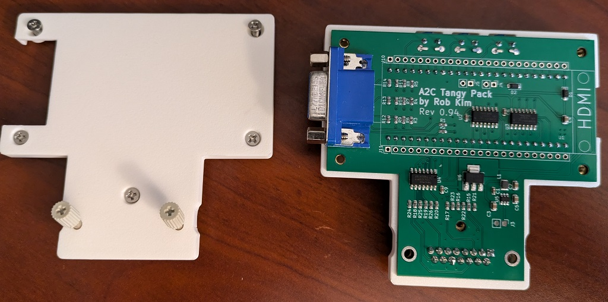
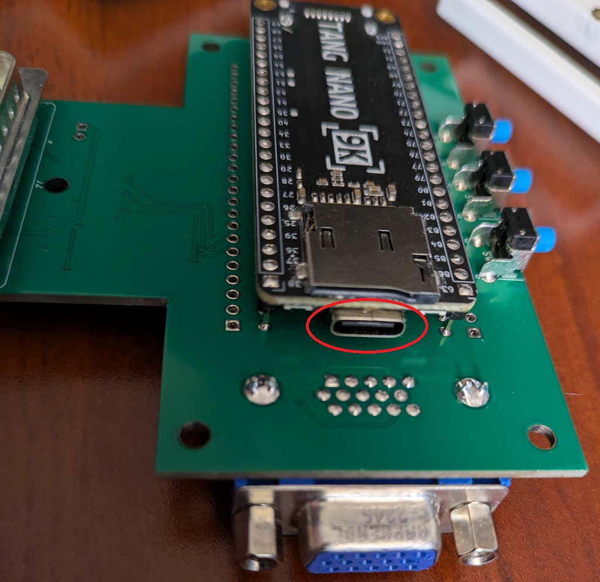
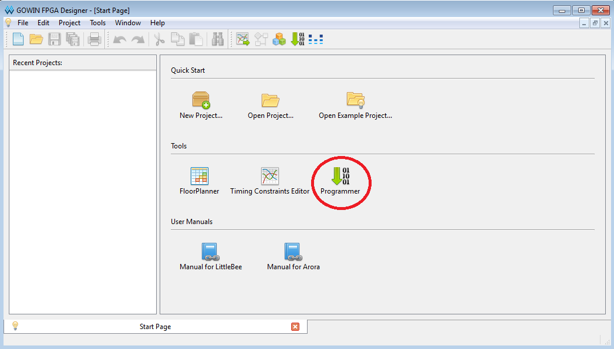
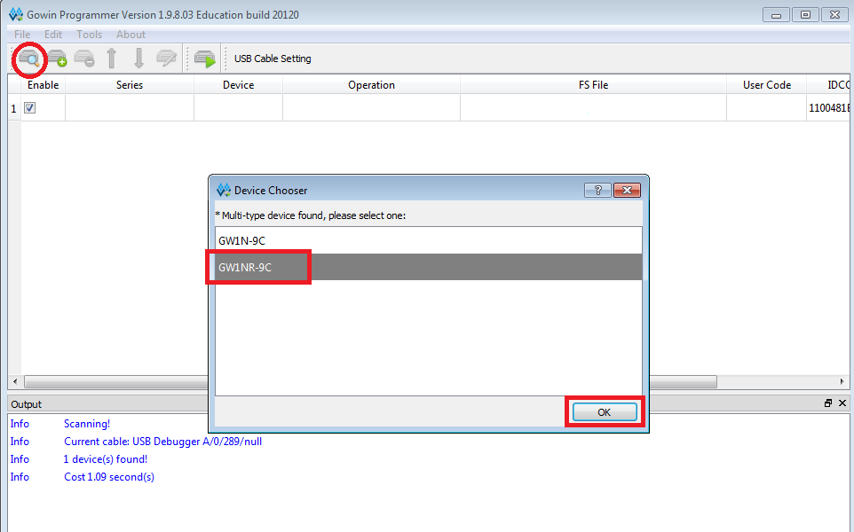
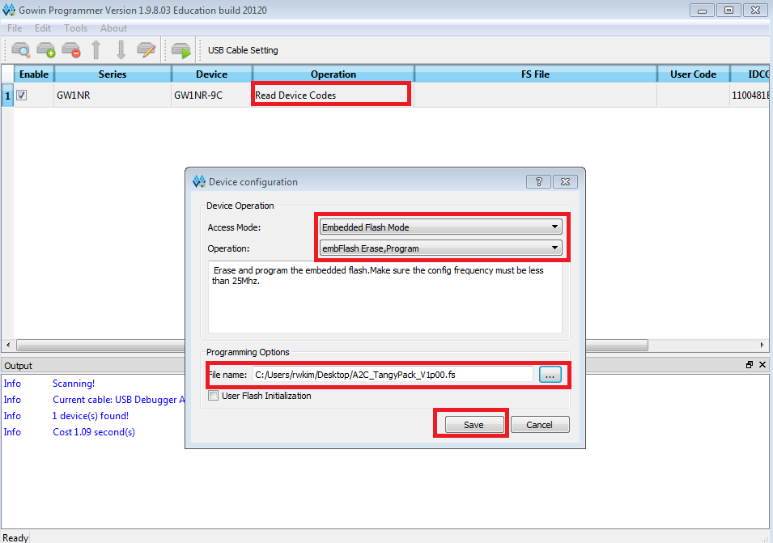
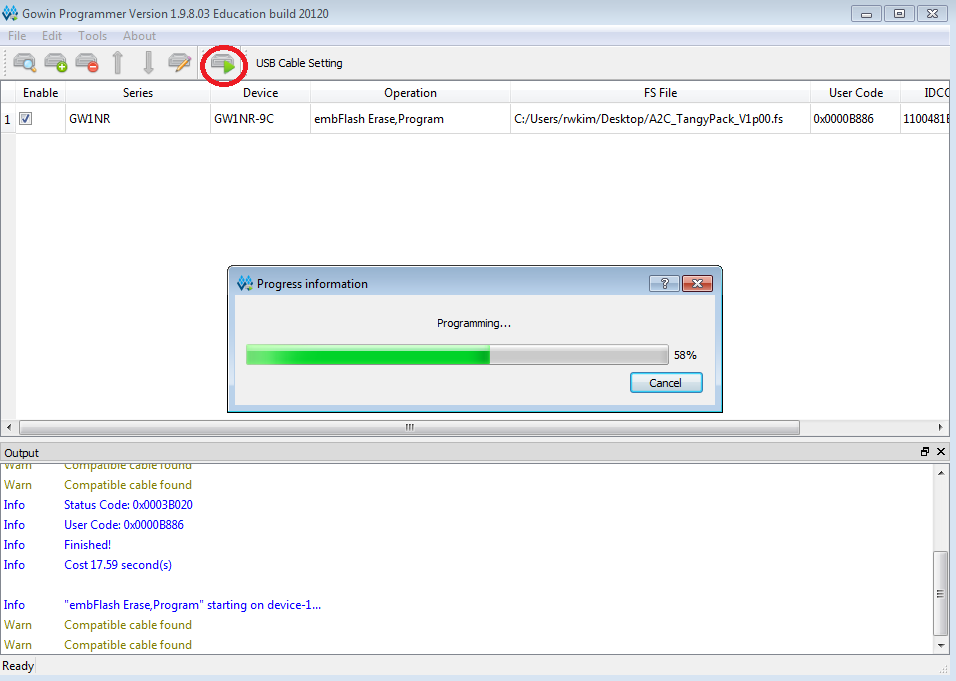

# Firmware Update Procedure

## Taking apart the Tangy Pack

Remove the 5 M3x8mm screws using a phillips #1 screw driver from the back of the Tang Pack.  Lift off the back, including the locking screws.  





Once the back is removed, remove the PCB from the front case and flip it over.  There is a USB C connector under the SD card slot.  



# Uploading the firmware

Once you have access to the USB C connector on the Tangy Pack, you have two options to upload the firmware file (Firmware_Name.fs).  Option 1, I feel is easier if you just want to upload the firmware.  Use option 2 if you want to get into development with Tang Nano FPGAs.

## Option 1: openFPGALoader

[openFPGALoader](https://github.com/trabucayre/openFPGALoader) is a fantastic open source software that allows you to program many FPGA boards from many manufacturers.   It works under Linux, Windows and macOS.  While the [installation guide](https://trabucayre.github.io/openFPGALoader/guide/install.html) has instructions for linux and macOS, the windows section is blank.

I was able to install and use openFPGALoader under Windows using the following [guide](https://fpga.mit.edu/6205/F22/documentation/openFPGA).  It uses [MSYS2](https://www.msys2.org/) for the actual install of the tool and command shell and [Zadig](https://zadig.akeo.ie/) for driver installation.  Only difference I ran into when following the guide was when replacing the FTDIBUS driver for WinUSB, my Tang Nano 9K device was listed as "JTAG Device" instead of "Digilent USB Device".  You need to update both interface 1 and interface 2 with WinUSB.

After you have installed the openFPGALoader, copy the firmware_name.fs file to a directory accessible from your MSYS2 command window.  Connect the Tang Nano 9K board to your computer and from the MSYS2 command window, you should be able to detect the board using the following command.

```
$ openFPGAloader --detect
No cable or board specified: using direct ft2232 interface
Jtag frequency : requested 6.00MHz   -> real 6.00MHz
index 0:
        idcode 0x100481b
        manufacturer Gowin
        family GW1N
        model  GW1N(R)-9C
        irlength 8
```

Assuming the firmware file is in the correct directory, you can use the following command to upload the new firmware

```
$  openFPGAloader -b tangnano9k -f A2C_TangyPack_V1p00.fs
write to flash
Jtag frequency : requested 6.00MHz   -> real 6.00MHz
Parse file Parse A2C_TangyPack_V1p00.fs:
Done
DONE
Jtag frequency : requested 2.50MHz   -> real 2.00MHz
erase SRAM Done
erase Flash Done
write Flash: [==================================================] 100.00%
Done
```


## Option 2: Install the Gowin EDA and Programmer

Gowin is the FPGA chip manufacturer.  They have a student version of the GOWIN EDA does not require any license to run.  It has reduced device support and feature, but the FPGA used in the Tang Nano 9K is supported

Sipeed is the manufacturer of [Tang Nano 9K](https://wiki.sipeed.com/hardware/en/tang/Tang-Nano-9K/Nano-9K.html) board used in the Tangy Pack.  They have a forked version of the Gowin programming software, that you must use to program the Tang Nano.

* [GOWIN EDA - Student Edition](https://magicjellybeanfpga.github.io/mjb/software.html)
* [Sipeed Tang Programmer](https://dl.sipeed.com/shareURL/TANG/programmer)


Once the EDA software and the programmer software has been installed, start the GOWIN EDA software.  Click on the Programmer icon.




Once the programmer software starts, connect the Tang Nano to the computer.  Click on the magnifying icon to scan for a device.  If two device shows up, select the GW1NR-9C and hit ok.



Double click on the Read Device Codes selection box.  This will bring up Device configuration window.  Select Embedded Flash Mode for Access Mode and Select embFlash Erase,Program for Operation.  

Navigate to the .fs file you want to upload for the file name and hit save



Click on the icon with green triangle to start the programming process.
You should see "Info Finished!" when the programming completes successfully.
 
