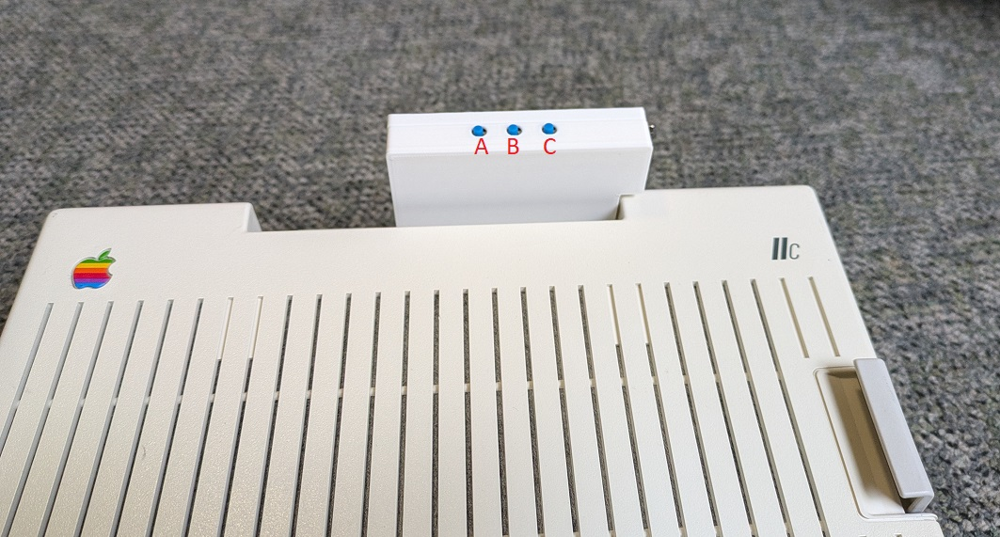

# A2C_TangyPack
Allows VGA and HDMI (DVI) video device to be connected to Apple IIc/IIc+ (US NTSC Machine only). 

[Laser 128 support](Laser128.md) added with Firmware V1.10

If you want to purchase one, it's avaiable from ct6502.org: [https://ct6502.org/product/tangypack/](https://ct6502.org/product/tangypack/)
 Please read the following [document](Compatibility.md) on compatibility before ordering. 

### WARNING!!!  Do not plug/unplug the device to/from the Apple IIc with the power on.  Damage to the device and/or to your Apple IIc can occur.  It is strongly recommended to lock the screw terminal down to prevent the device from being accidentally disconnected. 

* HDMI specification allows for hot plugging the connector.  
* Hot plugging VGA connector is not defined in the specification and there is mixed information regarding if it is safe.

# Descrpition
A2C_TangyPack plugs into the video expansion port of the Apple IIc/IIc+ and is powered from the port itself.  It is a scan doubling device that will take the 560x192 video of the Apple IIc and upscale the video to ~640x480 (720x480 @ 28.63MHz pixel rate) video resolution supported by most modern video monitors. 

## Compatibility
This became a larger topic that deserves a separate [document](Compatibility.md).   Please completely read through the document before you decide if the Tangy Pack will work for your and ordering the device

## Controls
Controls are simple.  Push the corresponding buttons to cycle through the options listed. Power on defaults are the first options of each row.  
  
  A - Toggles scanline effect On/Off  
  B - Color mode, Mono Green, Mono Amber, Mono White  
  C - Border off, Border White, Border Blue, Border Green  
  

# Firmware
Please read the following for the [Firmware Update](./Firmware/Firmware.md) procedure.
 Firmware release notes are [here](./Firmware/Firmware_Releases.md). 

# Case STL files
If you want to print your own case, the .stl files are available in the Case STL directory.   See the [Case_STL_readme](./Case%20STL/Case_STL_readme.md) for more information.
